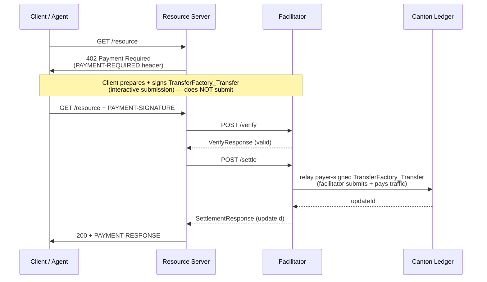

The [x402 protocol](https://x402.org) is an HTTP payment standard built around the `402 Payment Required` status code. A server responds with payment requirements; the client pays on-chain and retries. There are no API keys and no billing accounts; the payment itself is the credential.

On Canton Network, x402 uses the `exact` scheme with the `transfer-factory` settlement method (a CIP-56 Token Standard transfer). The client signs a `TransferFactory_Transfer` naming the merchant as receiver but does **not** submit it; the facilitator relays the signed transfer and pays the traffic fee, and because the merchant holds a standing `TransferPreapproval` it settles directly to the merchant in one transaction. There is no escrow, no lock step, and no facilitator custody.

## How It Works

The client signs the transfer off-ledger; the facilitator submits it in a single transaction.



The facilitator is the sole submitter: it relays the payer-signed transfer and pays only the sequencer traffic (gas). It signs nothing on the payer's behalf and never holds custody — the funds move from the payer's own holdings, and the merchant's `TransferPreapproval` is what makes the transfer resolve directly in one transaction.

## Scheme: `exact`

| Field | Value |
|---|---|
| `scheme` | `exact` |
| `asset` | `CC` |
| `assetTransferMethod` | `transfer-factory` |
| Networks | `canton:mainnet`, `canton:testnet` |

### PaymentRequirements structure

```json
{
  "scheme": "exact",
  "network": "canton:mainnet",
  "amount": "10000000000",
  "asset": "CC",
  "payTo": "<receiver-party>::1220...",
  "maxTimeoutSeconds": 60,
  "extra": {
    "assetTransferMethod": "transfer-factory",
    "feePayer": "<facilitator-party>::1220...",
    "synchronizerId": "global-domain::1220...",
    "instrumentId": { "admin": "<DSO-party>::1220...", "id": "Amulet" },
    "executeBeforeSeconds": 120,
    "memo": "invoice-2024-001"
  }
}
```

- `amount` is an integer string of **atomic units** (1 CC = 10^10 units), so `"10000000000"` = 1 CC. The facilitator compares by value (BigInt atomic units), so a 10×/0.1× error provably never folds, but the form must be a valid integer string.
- `feePayer` is the facilitator party — the relayer that submits the payer-signed transfer and pays its traffic fee. Clients MUST NOT alter it.
- `instrumentId` is the Canton Coin instrument `{ admin: "<DSO-party>", id: "Amulet" }`. The transfer-factory path settles Amulet/CC only.
- `executeBeforeSeconds` is a relative deadline (seconds from request time) the client uses to compute the transfer's absolute `executeBefore`; after it, the signed transfer is no longer executable.
- `memo` (optional) is a seller-defined string the client stamps into the transfer's metadata; the facilitator does not validate it.

> `feePayer`, `synchronizerId`, and `instrumentId.admin` (the DSO party) are deployment values. Get `feePayer` and `synchronizerId` from `GET /supported` on your facilitator; get the DSO party id from your Canton Scan API.

## The Facilitator

A facilitator is a service that bridges x402 and the Canton ledger. It holds a Canton party and relays the payer-signed `TransferFactory_Transfer`: it submits the transaction and pays the sequencer traffic fee, resolving the transfer's execution context (instrument config, amulet rules, active open round) from the SV Scan registry as disclosed contracts. It signs nothing on the payer's behalf; the funds move from the payer's own holdings, and the merchant's `TransferPreapproval` makes the transfer resolve directly. The merchant pays nothing per-request.

The facilitator exposes two endpoints that the resource server calls:

- `POST /verify` validates the payer-signed transfer against `PaymentRequirements` (no ledger write)
- `POST /settle` relays the signed transfer and returns the ledger `updateId`

Use `GET /supported` on any facilitator to discover its party ID, advertised method, and the networks it serves:

```json
{
  "kinds": [{
    "x402Version": 2,
    "scheme": "exact",
    "network": "canton:mainnet",
    "extra": {
      "transferMethods": ["transfer-factory"],
      "synchronizerId": "global-domain::1220..."
    }
  }],
  "signers": {
    "canton:*": ["<facilitator-party>::1220..."]
  }
}
```

Because `/supported` advertises `synchronizerId`, a 402 `extra` MAY omit it and clients will fall back to this value.

> `transfer-factory` runs through the standard CIP-56 `:TransferInstruction` interface — there is no custom DAR for merchants to install.

## Replay Protection

Canton provides native, on-ledger replay protection. The payer-signed transfer names specific input holdings; once it executes, those holdings are consumed, so resubmitting the same payload references already-spent holdings and the ledger rejects it. A facilitator MUST **relay** the signed transfer to settle — it MUST NOT treat a previously observed `updateId` as settlement, since a read of a completed update is replayable and moves no funds, whereas relaying the signed transfer is single-use by construction.

## Error Codes

| Code | Meaning |
|---|---|
| `invalid_exact_canton_missing_proof` | Payload does not reference a payer-signed submission (`submissionRef` / `preparedTxHash`) |
| `invalid_exact_canton_signature_invalid` | The submission is not validly signed by the payer over `preparedTxHash` |
| `invalid_exact_canton_amount_mismatch` | Transfer amount ≠ `PaymentRequirements.amount` (by value) |
| `invalid_exact_canton_merchant_mismatch` | Transfer receiver ≠ `payTo` |
| `invalid_exact_canton_instrument_id_mismatch` | Transfer instrument is not Canton Coin (≠ `extra.instrumentId`) |
| `invalid_exact_canton_preapproval_missing` | Merchant holds no live `TransferPreapproval`, so the transfer would not settle directly in one transaction |
| `invalid_exact_canton_fee_payer_mismatch` | `extra.feePayer` ≠ the facilitator's own (relaying) party |
| `invalid_exact_canton_expired` | `executeBefore` is past or within the safety margin |
| `invalid_exact_canton_self_payment` | The proven sender is the facilitator / fee payer; the facilitator must never move its own funds |
| `invalid_exact_canton_execute_failed` | The relayed transfer was rejected on execution — an input holding was already spent (concurrent settlement) or funds were insufficient. Transient input contention SHOULD be retried |
| `unexpected_canton_ledger_error` | Network mismatch, missing preapproval, or a Scan/ledger error not covered above |

